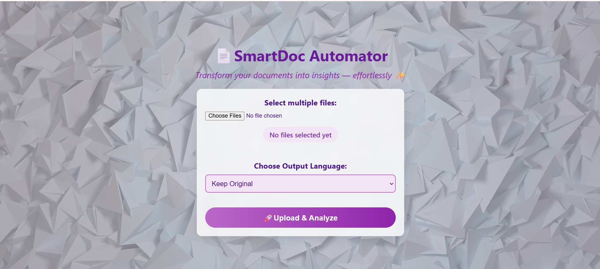

# 📄 SmartDoc Automator

Transform your documents into insights — effortlessly ✨  

---

## 🚀 Overview
SmartDoc Automator is a Flask-based web application that simplifies document automation. It supports text, audio, video, and image-to-text extraction, multi-file merging, and Excel/Word export. Enhanced with an AI chatbot, the app allows users to interact with extracted content, generate summaries, and preview results in a modern, stylish interface.  


---

## ✨ Features
- 📂 Upload multiple files at once  
- 📝 Extract text from documents, audio, video, and images  
- 📊 Save outputs into Excel and Word formats  
- 🖼️ Modern UI with previews, summaries, and timestamps  

---

## 🛠️ Tech Stack
- **Frontend:** HTML, CSS (custom styling, animations)  
- **Backend:** Flask (Python)  
- **Libraries/Tools:** OpenAI, PyMuPDF, SpeechRecognition, MoviePy, OpenCV, Pandas  

---
## 📂 Project Structure
```text
SMARTDOC/
│── output/ 
│── static/ 
│── templates/ 
│── uploads/ 
│── app.py 
│── init_db.py 
│── smartdoc_data.db 
│── requirements.txt 
│── Procfile 
│── README.md 
│── temp_audio.wav # Temporary audio storage
│── desktop.ini 
│── pycache/ # Python cache
```

<p align="center"> ✨ Maintained by <a href="https://github.com/yashhavalannache">Yash Havalannache</a> ✨ </p> 

